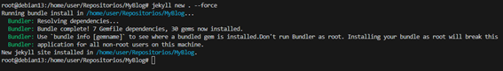
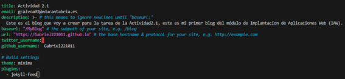
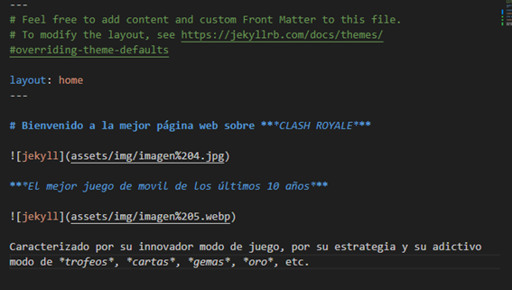
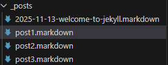

# Documentación Ejercicio1 Guía creación de sitio de web en Jekyll

## Paso 1

El primer paso sera crear el sitio web de ***Jekyll***, para ello utilizamos el comando **"jekyll new --force"**, y se nos creara la página web de ***Jekyll*** dentro de la carpeta **MyBlog** tambien podemos anteriormente iniciar esta carpeta como un repositiorio remoto conectado a ***Github*** para crear dentro de este el sitio web.

Podemos comprobar con *ls* que se ha creado todos los archivos y ficheros de ***Jekyll*** dentro del repositorio

## Paso 2

Ahora configuramos el archivo **"_config.yml"**, y dentro cambiaremos varias cosas:

- **El título**: ponemos el titúlo que queramos

- **Email**: pondremos una email nuestro, en mi caso el email de **educantabria**

- **Descripción**: pondremos una breve descripción del blog

- **Baseurl**: ponemos la ruta donde se encuentra el blog

- **Url**: ponemos la url de nuestro **Github**

- **Github_username**: ponemos el usuario de nuestra cuenta de **Github**

Cerramos y guardamos el archivo. Ahora pasaremos a la parte de configurar los archivos del sitio web, index.md, about.md, etc.

## Paso 3

Vamos con el fichero de **"about.markdown"**, en este fichero creamos una presentacion nuestra, hablando de nosotros y de nuestras aficiones. Este fichero una vez dentro del sitio web de ***Jekyll***, aparecerá arriba a la derecha.

Ahora configuramos el fichero **"index.markdown"**, este fichero sera el principal de la página donde se vera la estructura de la página, accederas a los post, enlaces, fotos, etc.

En mi caso como mi página va a ser sobre el ***Clash Royale***, pues he puesto un pequeña introduccion sobre el juego con un par de fotos para que sea atractivo

Como tenemos que crear un tercer fichero, he decidido crear uno donde se hable de la historia de ***Clash Royale*** y de ***Supercell***, que es la empresa que ha creado el juego

## Paso 4

Ahora vamos con los **post** de la página. Crearemos tres nuevos **post** que tendrán que ver con el contenido de la página web. En mi caso, **un post** explicara todo acerca del juego, como jugar, *cartas*, *cofres*, *gemas*, etc. En el segundo post hablaré sobre el **mundial** de ***Clash Royale***, y por último, en el tercer post hablaré de las **polémicas** que ha tenido con el precio de las cosas dentro del juego

## Paso 5

Aquí podemos ver un ejemplo de post, en este caso el de las polémicas, podemos ver que su estructura es muy sencilla

# Comprobación

Ahora después de realizar todo comprobamos que vaya bien nuestro sitio web, para ello ejecutamos "**bundle exec jekyll serve --host "IP Host"**"

