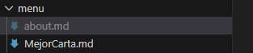
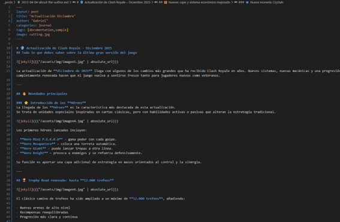
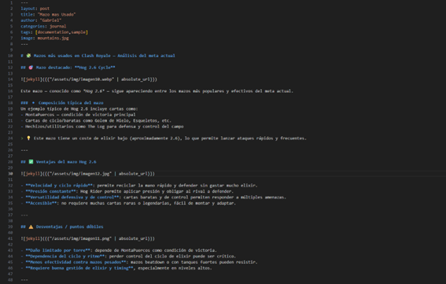

# Importar, desplegar y configurar el tema "LAGRANGE" en GitHub Pages

## Paso 1

Para empezar tenemos que acceder al repositorio del tema ***Lagrange***, usamos el enlace de Luis para llegar a alli y acceder 

Una vez dentro del **GitHub**, usaremos el método **"Forking"** y pulsaremos en el Fork para tener el tema ***Lagrange*** en nuestro **GitHub**

Después solo tendremos que hacer el **git pull** para bajarnos el tema 

## Paso 2

Ahora comenzamos a configurar el tema, para ello empezamos creando una página nueva dentro de **"menu"**, ahora tenemos el **about.md** y la página creada en mi caso, **MejorCarta.md**

Aqui podemos ver un poco la estructura de la página de **MejorCarta.md**

Y aqui podemos ver un poco la estructura de la página de **about.md**

## Paso 3

Después de las páginas debemos de crear y modificar tres nuevos *post*

El primer *post* en mi caso sera sobre la reciente actualizacion de diciembre de ***Clash Royale***, una de las actualizaciones más grandes hasta la fecha, en este *post* destaco todo sobre esta.

El segundo sera acerca del sistema de **Clanes y Guerras de Clanes**, un sistema parecido al de otros juegos de ***Supercell***, hablaré de las recompensas, donaciones, puntos, etc.

Y el último será sobre el mazo más usado de ***Clash Royale***, destacaré las ventajas, desventajas y el funcionamiento de este, aclarando por que es el mejor mazo según la **Comunidad**

# Comprobación

Para terminar, comprobamos que se haya subido todo correctamente, después de hacer algunas configuraciones en **"settings.yml"** sobre el *menu* e iconos de *redes sociales*
